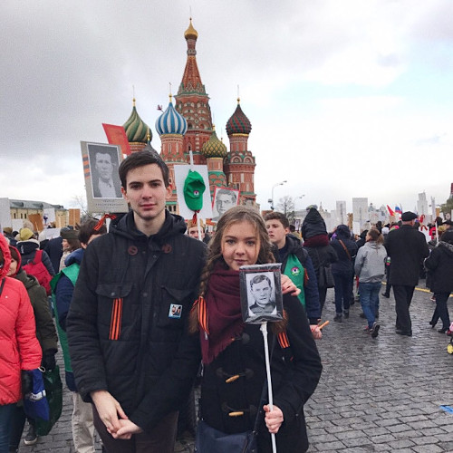

# Quelques mots d'introduction
Je m'appelle Ophir, et je suis élève en école d’ingénieur.

Après deux ans à l'École Centrale de Nantes,
j'ai choisi de faire mes deux dernières années d'études à
l'étranger, non pas dans une université européenne cotée comme la
plupart de mes camarades, mais en Russie, dans un cursus entièrement
en russe de l'université technique d'État de Moscou.

Ce rapport relate les particularités, les difficultés et les
choses fascinantes que j'ai rencontrés pendant mes deux ans
d’études à Moscou.

# Présentation générale du pays

La Russie est un pays fascinant. En France, on n'en entend en général parler
que dans des articles critiquant la politique de Vladimir Poutine.
Pourtant, et bien que la politique russe soit un sujet intéressant,
il y a beaucoup plus à découvrir à propos de ce pays.
Mon objectif ici sera de donner une vision de la Russie telle
que je l'ai vécue, en essayant de m’éloigner des stérétypes et
des généralités, et si possible en donnant des informations
utiles aux étudiants qui seraient tentés par la
formidable mais difficile expérience que constitue l'expatriation en Russie.

## La fédération de Russie, un pays multiethnique à l'histoire riche

### Le pays qui se prenait pour un continent

Il suffit de regarder une mappemonde pour comprendre la première raison pour laquelle la Russie fascine : c'est tout simplement le plus grand pays du monde. Voisin à la fois de la Pologne et de la Corée du Nord, le pays s'étend sur des milliers de kilomètres, entre l'Europe et l'Asie. Les russes que j'ai rencontrés ne se sentent d'ailleurs ni européens ni asiatiques, et n'hésitent pas à comparer leur pays aux autres continents, et en premier lieu à l'Europe...

En France, l'ensemble du territoire métropolitain est divisé en régions de taille à peu près égales, et qui ont toutes le même statut administratif. En Russie, c'est un peu plus compliqué : il y a dans la Fédération de Russie 22 républiques, qui ont chacune une constitution, une administration propre, et une identité culturelle forte. Mais ces républiques ne couvrent qu'une partie du territoire russe, qui est aussi composé d'*oblasts*, de *kraïs*, de *districts autonomes* et de *villes d'importance fédérale* (Moscou, Saint-Pétersbourg et Sébastopol).

La capitale est une mégalopole moderne, et bien qu'elle soit le centre de la Russie moderne,
le mode de vie n'y est pas vraiment représentatif de celui des habitants des villes plus petites.
C'est en partie pour cela que voyager en Russie est une expérience indispensable,
que je recommande à tous ceux qui viendraient étudier à Moscou.

J'ai personnellement fait quatre véritables voyages en Russie:

#### Crimée

J'ai été en Crimée, hébergé gratuitement dans un des centres de vacances de l'université. Ce fut
 l'occasion de rencontrer en dehors d'un cadre universitaire d’autres étudiants, y compris
 des plus jeunes que l'on a moins l'occasion de fréquenter à l'université, et de parler avec des
criméens de la fameuse «annexion de la Crimée».
Les paysages du long de la côte sont magnifiques, avec de grandes montagnes qui se jettent
dans la mer noire.

#### Kazan

Une ville magnifique, capitale de la république du Tatarstan.
Il y a dans le kremlin de Kazan une mosquée gigantesque, verte et blanche, très moderne et magnifique.

#### Saint-Pétersbourg

Probablement la plus européenne des villes russes que j'ai visitées. Les bâtiments y sont
moins imposants qu'à Moscou, et les canaux donnent une atmosphère très agréable à la ville.

#### Le transsibérien

Juste après avoir défendu mon mémoire de master, je suis parti pour une traversée de la Russie en train,
jusqu'en Mongolie. Nous sommes partis en couchsurfing, et avons visité Oufa, Novosibirsk,
Irkoutsk, Oulan Bator (en Mongolie) et Oulan Oudé. Ce rapport n’a pas vocation à être un guide touristique,
et je ne raconterai donc pas ici ce voyage en détails, mais il a vraiment constitué une expérience
inoubliable, l'occasion de rencontrer des gens très différents, de voyager à travers différentes
cultures et différents modes de vie russes. Je pense qu'il aurait été dommage de visiter la Russie
sans voir sa moitié asiatique.

## Moscou, l’incroyable capitale-paradoxe
Malgré les quelques voyages mentionnés, la seule ville russe que je puisse me vanter de connaître un
peu est Moscou.

### Se promener

Si l'on compte la capitale russe comme une ville européenne, alors c'est
de loin la plus grande et la plus peuplée.
L'immensité de la ville est sans doute ce que l'on remarque en premier en arrivant.
Non seulement la ville est grande, mais les bâtiments eux-mêmes sont souvent très imposants,
les cathédrales gigantesques et certaines rues de la ville - comparables à nos autoroutes.

C'est en partie pour ce dernier point qu'il n'est pas agréable de se promener partout dans Moscou.
Malgré cette immensité parfois opressante pour quelqu'un habitué au quotidien d’une ville française,
on peut trouver de nombreux endroits agréables à Moscou.
Les quartiers les plus agréables sont probablement ceux de l'ultra-centre, où l'on peut trouver certaines
petites rues bordées de cafés comme en Europe.
Le quartier de notre université (Bauman) est aussi plutôt agréable, on y trouve de bons petits restaurants
et une vie animée.
Sinon, pour se promener, il faut préférer les parcs de
Moscou (eux aussi gigantesques), comme le parc Gorki ou VDNKh (ВДНХ).

### Se loger dans une ville hors de prix
L’immobilier à Moscou coûte très cher. Peu d'étudiants peuvent se payer
leur propre appartement, ou même une collocation
(pratique peu courante en Russie, d'ailleurs).

Beaucoup d'élèves de l'université de Bauman vivent dans des résidences étudiantes du quartier d’Izmaïlovo,
à quatre étudiants par chambre, avec douches et toilettes communes pour chaque étage.

Lors de mon arrivée, mes camarades français et moi avons tout d'abord été logés dans le quartier
d'Altufievo, à une heure en métro de l'université, dans
une résidence spéciale pour les étrangers. Cette résidence a un tout petit loyer
(moins de 3000 roubles par mois), et jouit de conditions plus favorables que celles
où logent les russes:
deux par chambre, cuisine et douche communes pour chaque appartement de trois chambres.
Cette résidence nous a bien dépannés quand nous sommes arrivés, mais
les conditions d’hygiènes et son éloignement de l'université comme des autres élèves russes
me font douter de la pertinence même de son existence...

J'ai donc décidé, une fois que je commençais à parler un peu russe, de chercher un nouveau
logement. J'ai finalement trouvé une chambre dans une collocation moderne de deux personnes,
avec une salle de bain et une cuisine correctes, pour 30 000 roubles par mois, dans laquelle
je suis resté jusqu’à la fin de la première année.

La seconde année, j'ai d'abord vécu dans une autre résidence de l'université, aux conditions
de vie moyennes, mais toute proche de l'université, et au loyer dérisoire, comme la première.
La résidence était mixte entre russes
et étrangers, mais les étrangers étaient quand même tous regroupés au dernier étage.

Je me suis finalement installé avec ma copine dans un tout petit appartement dans un
"quartier-dortoir" de Moscou, pour 20 000 roubles par mois.

### Gagner de l'argent
Moscou est une ville où les salaires sont beaucoup plus élevés que dans le reste de la Russie,
et les conditions économiques font qu’il n’est pas difficile de trouver de travail, surtout quand on
est qualifié dans un domaine comme l'informatique.

 Dans mon master, de nombreux élèves travaillaient pour financer leurs études,
parfois déjà à des postes à responsabilité avec plusieurs années d'expérience.

J’ai personnelement trouvé un travail de programmeur à mi-temps payé correctement
(70 000 roubles/mois), et dans un environnement agréable juste à côté de l'université
 après quelques semaines de recherches, et avec un niveau de russe moyen seulement.
 J'ai dû demander une autorisation spéciale à l'université pour obtenir le droit
 de travailler légalement avec mon visa étudiant.

Beaucoup d’élèves français préfèrent se tourner vers le tutorat et les cours
particuliers pour gagner de l'argent. Il y a à Moscou un lycée français, et l'on
peut donner des cours particuliers en français dans toutes les matières, pour un salaire
plus élevé qu'en France.

## La langue russe, dure mais indispensable

*Guerre et paix*, *Anna Karénine*, *L'Idiot*, *Lolita*: la langue russe est celle de certains des plus grand chefs d’œuvres de la littérature mondiale. C'est aussi une clef essentielle sans laquelle on ne peut aller vraiment à la rencontre de la culture russe moderne. Et enfin, c'est une *lingua franca* sur tout le territoire de l'ex-URSS, de Riga à Vladivostok, d’Erevan à Saint-Pétersbourg.

Beaucoup de russes, y compris chez les jeunes élèves-ingénieurs, ne parlent que le russe. Ceux qui s'expriment correctement en anglais (ou dans une autre langue), sont ceux qui ont pris des cours particuliers ou ont vécu à l'étranger, le système d'apprentissage des langues à l'école étant plutôt mauvais.

Il est donc absolument indispensable d'apprendre le russe pour poursuivre ses études d'ingénieurs, rencontrer des gens, voyager, et tout simplement se débrouiller dans la vie de tous les jours.

La langue russe n'est pas d'une difficulté insurmontable pour les français, mais elle reste plus éloignée de notre langue que l'allemand, l'anglais, ou l'espagnol, et plus difficile à apprendre. Il faut donc consacrer du temps et de l'énergie à l'apprentissage ou au perfectionnement de son russe dès son arrivée.

Je suis arrivé en Russie avec un très faible niveau de russe. Après six mois de *langues étrangères appliquées* à l'Université de Nantes, et malgré un très bon professeur, je ne connaissais que l'alphabet, quelques mots, et les bases du fonctionnement de la grammaire.

Les premiers mois ont donc été à la fois difficiles et passionnants. L'objectif étant de réussir les premiers examens (ceux de Noël) sans rattrapages, il fallait que je sois rapidement capable de comprendre et répondre à des questions orales en russe sur le contenu des cours.

Pour progresser à l'oral, la meilleure solution est probablement de pratiquer beaucoup, et régulièrement, sans avoir peur de ne pas se faire comprendre, de ne pas comprendre ce que l'on nous dit ou d'avoir l'air ridicule. J'ai donc commencé à parler tous les jours et avec tout le monde, d'abord avec les quelques mots que je connaissais et en foulant aux pieds toutes les règles de grammaire, puis, au fur et à mesure, en essayant d'intégrer les mots et les règles que j'apprenais. Je me suis inscrit sur le site italki où j'ai trouvé des partenaires de langue qui apprenaient le français et étaient prêts à donner des leçons de russe en échange de leçons de français. Je me suis inscrit sur tinder, où j'ai échangé d'abord par écrit, puis lors de rencontres, en russe avec des jeunes filles russes. La sensation de progresser de jour en jour, sans jamais apprendre de leçons ou de tableaux de déclinaison, est très agréable et motivante.

La professeure de russe que nous avons eue à l'université nous a également beaucoup aidé à intégrer toutes les nouvelles
règles dont nous avions besoin pour parler, lire, écrire et comprendre. Les cours de russe de l'université se déroulent en tout petits groupes composés d'étrangers de différents pays, et sont donnés intégralement en russe, ce qui aide aussi beaucoup à progressser rapidement. Svetlana, notre professeure, était en plus une personne formidable et chaleureuse, avec laquelle nous avons tissés des liens d'amitiés au cours des deux années de cours que nous avons eus avec elle.

Aujourd'hui, après deux ans de russe, nous sommes tous capables d’avoir une conversation normale en russe,
d’exprimer un point de vue, de parler de notre domaine d'’études en russe, à l'oral et à l'écrit.
Nous suivons nos cours et passons nos examens en russes sans grosses difficultés de langue.
Cependant, notre niveau est toujours loin d'être parfait, nous faisons régulièrement des fautes, avons toujours un
accent français clairement audible, et la littérature ou la poésie russes nous sont toujours difficiles
à appréhender.

## Traditions et mentalité russe, un autre regard sur le monde

La mentalité, les habitudes, et les points de vues des russes sur les affaires
du monde comme sur la vie de tous les jours sont parfois différents de ce à quoi
nous sommes habitués en Europe occidentale. C'est en partie pour découvrir
ces différences que j'avais décidé de partir, et il est toujours passionnant de découvrir une autre culture, mais il peut aussi parfois être difficile de s'habituer à ces différences de mentalités...
Je vais donc ici en lister quelques unes, et si vous entreprenez plus tard le même voyage que moi, vous serez moins surpris.

### Relation à l’histoire tourmentée du pays
La Russie d’aujourd’hui est toujours profondément marquée par la seconde guerre mondiale.
L’URSS est le pays qui a payé le plus lourd tribu lors de la seconde guerre, et à Moscou,
la quasi-totalité des familles compte au moins un grand-père ou un arrière grand-père mort à la guerre.
Ce souvenir tragique est ainsi inscrit dans toutes les mémoires, et les russes ne tolèrent pas que les occidentaux
sous-estiment l’importance cruciale de l’URSS dans la victoire contre le nazisme, trouvant même parfois injuste le manque
de reconnaissance du reste du monde aux soldats russes qui ont donné leur vie pour vaincre l’Allemagne d’Hitler.
La victoire contre le troisième reich est encore aujourd’hui célébrée tous les ans lors de la fête du *jour de la victoire (день победы, le 9 mai)* par de gigantesques cérémonies à travers toute la Russie.

D'autres éléments de l'histoire russe, qui peuvent nous sembler plus importants en Europe, sont au contraire moins présents dans les mémoires, les récits, et l'imaginaire national. C'est par exemple le cas des répressions politiques et des goulags soviétiques, dont on parle beaucoup moins. Le personnage de Staline, par exemple, est vu avant tout comme le vainqueur de la seconde guerre mondiale et la personne qui a délivré le monde du nazisme beaucoup plus que comme un tyran qui a fait envoyer au goulag des centaines de milliers de russes.
Un autre exemple est a révolution russe, que tous les russes connaissent, bien sûr, mais qui n'est pas du tout célébrée.

Pour ce qui est de l'histoire récente, et notemment l’URSS, les personnes que j’ai pu rencontrer à Moscou qui ont vécu en Union Soviétique en avaient en général des souvenirs positifs, notamment parce que les inégalités se sont beaucoup accrues depuis la chute de l'URSS. Cependant, les idées communistes ne sont pas répandues du tout chez les jeunes, qui ont en général une vision de l'économie proche de la notre. La Russie d’aujourd’hui est d’ailleurs à bien des égards un pays beaucoup plus capitaliste que la France, avec par exemple des impôts plus faibles, et un plus faible interventionnisme de l'État dans les affaires sociales.

Pour finir avec l’histoire la plus récente, les années 90 sont une période noire de l’histoire de la Russie, à laquelle la libéralisation brutale de tous les secteurs de l'économie et la désagrégation du pouvoir de l'état ont laissé la place au chômage, à l'insécurité, à la mafia, à l'appauvrissement brutal de nombreuses personnes et à l'accapparement des richesses du pays par une oligarchie. Cette période est dans toutes les mémoires, et elle explique en partie la popularité du président Poutine, qui symbolise le retour de l'État fort après cette période trouble.

Aujourd’hui, le pays est marqué par de très fortes inégalités, et il y a à Moscou aussi bien des personnes âgées qui mendient, des travailleurs pauvres, des quartiers entiers déshérités, que des quartiers de villas ultra-sécurisées pour milliardaires, des voitures de luxe dans la rue, des hommes politiques qui possèdent villas de luxe, yachts, et jets privés...

### Les relations sociales: respect, amour et amitié dans l'esprit de l’*âme russe*
 Les relations sociales, que ce soit avec des supérieurs, des amis, ou avec son partenaire, sont parfois différentes de nos conventions sociales françaises. Et la sincérité, la dévotion, et le respect de beaucoup de russes est une des choses que j’ai appréciées.

Il peut sembler, en arrivant à Moscou, que les russes sont très froids et secs. Et c'est vrai, le plupart du temps, les russes ne se comportent pas en amis avec les gens qu'ils ne connaissent pas. Il y a, me semble-t-il, beaucoup moins de relations superficielles, de personnes à qui l'on parle régulièrement sans être amis. Il y a bien sûr des exceptions, mais les gens ne vont en général pas vous taper dans le dos, vous raconter leur vie ou vous poser des questions personnelles si ils ne sont pas vraiment amis avec vous. Mais au contraire, si l'on réussit à percer cette carapace, les russes ont souvent une âme beaucoup plus chaleureuse, plus généreuse, et plus dévouée que les français que j'ai rencontrés. Tous les russes que j'ai rencontrés appellent tous leurs amis au téléphone très régulièrement, ne répondent jamais «je suis occuppé» quand un ami veut les voir, ne s’écrivent pas juste «joyeux anniversaire», mais de longs messages d’anniversaire personnalisés, et bien sûr boivent de la vodka ensemble régulièrement.

La vision des relations entre hommes et femmes est elle plus traditionnelle que ce à quoi l’on peut être habitué en France. Ainsi, la galanterie est très importante: il est bien vu de laisser sa place aux femmes dans le métro, qu'elles soient plus âgées ou non,   on offre régulièrement des fleurs aux femmes qui nous sont chères, et lors d’un rendez-vous galant, il ne faut pas envisager de partager l'addition si l'on est un homme. La journée internationale de la femme est beaucoup plus importante en Russie qu’en France, et on la souhaite à toutes les femmes de son entourage, en offrant des fleurs et des cadeaux. De manière générale, les hommes se doivent de faire attention au bien-être des femmes qui les entourent. Mais ce respect dû aux femmes vient avec une vision traditionnelle et parfois machiste du rôle des femmes. Une amie russe m'a ainsi déjà raconté avoir été l'objet de remarques sexistes d’un professeur âgé à l'université, et beaucoup d’hommes en couple considèrent naturel que l'on prépare à manger pour eux. Au sein du couple, les relations sont souvent pleines de passion et de revirements, et le divorce est courant et pas plus mal considéré qu'en France, il me semble.

Pour ce qui est des relations à ses supérieurs, comme par exemple à ses professeurs à l'université, elles se doivent d’être respectueuses: vouvoiement, utilisation du prénom et du patronyme (et non du nom de famille, comme un français pourrait s'y attendre), formules de politesse dans ses messages écrits, et acceptation des règles fixées. Mais ces relations respectueuses peuvent être teintées d'affection, et les professeur sont en général très gentils avec les étudiants européens.
Pour les relations de travail, l’entreprise dans laquelle j’ai travaillé était une startup et les relations y étaient très détendues, très conviviales, loin de ce que je m'imaginais avant d’y rentrer.

### Racisme, antisémitisme, homophobie, et autres joyeusetés
La tolérence à tout ce qui s’éloigne de l’homme slave hétérosexuel chrétien est encore
parfois un problème en Russie aujourd'hui. Les plus jeunes générations sont en général plus
tolérentes, mais même parmi elles, il peut encore arriver d’entendre des remarques qui risquent d’être choquantes pour un
européen moyen.

Je porte moi-même un prénom juif, et il m'est arrivé plusieurs fois d'entendre des *blagues* pleines
de préjugés. Jamais personne ne m’a fait ce genre de remarques par méchanceté, ou avec l’objectif de me nuire,
et je ne pense pas qu'elles ne m'aient jamais empêchées de me faire des amis. Ces remarques témoignent simplement de
la persistance dans la culture populaire de stéréotypes qui, bien qu'ils soient aussi présents en Europe,
sont ici moins répandus et plus tabous.

La Russie est le deuxième pays au monde accueillant le plus d’immigrés, et de toutes les villes du pays, c’est
Moscou qui en compte le plus. La population d’immigrés compte notemment un grand nombre de personnes originaires
d’Asie centrale (tadjiks, ouzbeks, kirghizes) qui occuppent en général des métiers physiques dans des conditions
difficiles, sont pauvres, et parfois mal considérés du reste de la population. Bien sûr, tous les russes ne sont pas racistes,
mais il faudra par exemple vous attendre à être contrôlés plus souvent par la police, à avoir plus
de mal à louer un appartement, et peut-être même à vous faire des amis si vous n’êtes pas blanc de peau.
Je n'ai par exemple pas subi un seul contrôle d’identité durant tout mon séjour de deux ans, alors qu’une amie, qui est elle russe depuis toujours, mais a un physique asiatique, est contrôlée régulièrement.
Il faut tout de même nuancer ces observations par le fait que l'université de Bauman accueille de nombreux étudiants étrangers, avec lesquels les étudiants russes s'entendent en général bien, et que je n'ai jamais observé quoi que ce soit qui s'apparenterait à du racisme à l'université.

L'homophobie est je pense le cas d’intolérence le plus présent et le plus fort. L’homosexualité, souvent appelée en Russie appelée *orientation sexuelle non-traditionnelle*, et en particulier l’homosexualité masculine, est toujours très mal considérée par une majorité, y compris chez les jeunes. Beaucoup de gens considèrent l'homosexualité comme un problème, une maladie, ou un comportement déviant qui devrait si ce n'est disparaître, au moins être caché autant que possible.

# L’administration
La Russie a, depuis l'époque tsariste, un goût prononcé pour l'administration, les procédures complexes mais standardisées, et les multiples signatures à récolter sur les papiers officiels.

## L’administration à l'université: tout est difficile, mais tout est possible
La tradition des procédures complexes et parfois inutiles perdure aujourd’hui, et on la retrouve bien sûr dans les formalités administratives de l'université. J’ai par exemple reçu un papier avec onze cases correspondant à onze départements de l'université après avoir défendu mon master: il fallait obtenir une signature dans chacune des cases pour recevoir mon diplôme. Mais tout le paradoxe se trouve dans le fait que malgré que presque tout soit standardisé, il est souvent possible de négocier, et en s’adressant poliment et gentiment aux bonnes personnes, on finit en général par obtenir tout ce que l’on veut.

### Premier contact: le département international

Le département international est le seul où l’on trouve des gens qui parlent un peu anglais. Des gens, c'est-à-dire Tatiana et Sofia, les deux responsables qui se sont occuppées de nous les français depuis notre arrivée. Se sont des personnes adorables, et des alliées indispensable lors de notre arrivée en terre inconnue. C'est à elles qu'il faut poser toutes les questions qui concernent l'administration! Et le département international est le seul où les employés parlent un peu anglais.

C'est avec ce département que j'ai été en relation avant mon arrivé, ce sont eux qui gèrent notre acceptation, notre inscription, et notre accueil. Pour l’accueil, venant de Centrale Nantes, je m'attendais à un commité d'accueil proche de celui que l'on réserve en France à nos étudiants étrangers. Que nenni! Le premier jour, nous avons dû trouver nous-même la résidence, et expliquer tant bien que mal notre situation à la gestionnaire qui ne parlait bien sûr que russe.

Par contre, pour les formalités administratives, le département international peut vraiment aider. Ce sont eux qui nous indiquent comment refaire nos visas, payer la résidence étudiante, et obtenir une carte étudiante, par exemple.

### Les méandres du *décanat*
Le décanat (деканат) est le bureau dans lequel sont gérés les dossiers étudiants. Il dépend de la faculté à laquelle on est inscrit. C'est à cet endroit que toutes nos notes sont conservés, et c'est ce même décanat qui émet les diplômes. Malheureusement, le fonctionnement du décanat est obscur pour les nouveaux arrivants. Et inversement, le fonctionnement des doubles-diplômes leur est probablement aussi obscur. Ainsi, durant mes deux années d’études, je n'ai jamais été inscrit dans le système informatique de l'université, et le décanat n'a commencé à s'en inquiéter qu'à la fin de la deuxième année quand je suis venu leur demander ce qu'il me restait à faire pour obtenir mon diplôme. Le système de transmission des notes et des matières validées n'étant pas automatisé, il est également possible d’avoir des matières que l'on croit avoir validé, mais qui sont marquées comme manquantes dans le dossier du décanat.

Mais, comme souvent avec l'administration russe, en étant poli et de bonne volonté, on finit toujours par régler tous ses problèmes. Ainsi, quand à la fin de la seconde année, j'ai appris que je n'avais pas validé des cours du premier semestre de la première année, je n'ai eu qu'à passer quelques jours à faire des aller-retours entre différents bâtiments de l'université pour récolter diverses signatures, et le problème a disparu. Je n'ai eu à repasser d'examens ou faire autre chose que demander gentiment des signatures sur un petit carnet.

Cependant, si je pouvais donner un conseil aux futurs élèves étrangers dans ma faculté, ce serait d’aller au moins une fois par semestre au décanat pour vérifier que son dossier est en ordre.

### Faculté, chaire
La faculté est une entité de l'université regroupant tous les enseignements liés à une thématique générale (mathématique, physique, informatique). Chaque faculté est divisée en chaires qui correspondent chacune à un domaine précis de la thématique. Chaque nouvelle génération d'étudiants dans une chaire constitue un groupe d'élèves qui se connaissent entre eux, vont en cours magistraux ensemble, et s'entraident. La chaire est elle-même divisée en groupes d'étudiants, qui vont en travaux dirigés ensemble.

Le directeur de la chaire est normalement la personne qui a accepté le dossier de l’étudiant étranger, et veille de plus ou moins loin à sa réussite. L'aide aux étudiants étrangers ne rentre directement dans les obligations d'aucun des membres de la chaire (directeur, professeurs, secrétaires), et il faut donc demander explicitement de l'aide pour en obtenir. Il est très courant, surtout au début, avec un faible niveau de russe, de ne pas faire des devoirs ou de manquer des cours simplement parce que l'on n'a pas compris ce qu'il fallait faire. Il ne faut donc pas hésiter à son arrivée à aller voir les professeurs à la fin des cours pour expliquer sa situation d’élève étranger ne comprenant pas très bien le russe: ils sont en règle générale très compréhensifs.

Encore une fois, il est presque toujours possible de s'arranger en étant gentil et poli: aucun devoir non fait, aucun cours manqué, et même aucun examen raté n'est éliminatoire! Il suffit en général d'expliquer sa situation de bonne fois et avec diplomatie pour trouver un compromis, parfois sous forme de rattrappage, parfois simplement en validant une matière sans avoir tous les prérequis.

## L'administration de l'État, parce qu'on ne rigole pas avec la loi
### Le visa

Les règles d’immigration russes sont elles (bien sûr) strictes et non négociables. Il faut notamment obligatoirement pour obtenir un premier visa à entrée simple un test VIH négatif et une assurance privée. Ce sont des formalités embêtantes (et qui peuvent être chères) à faire avant de partir. Par contre, une fois sur place, c'est l'université qui s'occuppe de faire un nouveau visa (à entrées multiples, cette fois) lorsque le premier arrive à échéance. C'est à ce moment-là beaucoup plus simple: il suffit de donner son passeport au département international, et on obtient son nouveau visa en quelques semaines.

### L'enregistrement, pour ceux dont la tête ne plaît pas à la police
La loi de la fédération de Russie oblige tous les étrangers restant plus d’une semaine à communiquer aux autorités son lieu d’habitation. Cette procédure s’appelle *l'enregistrement (регистрация)*. Elle est effectuée par l'université pour les étudiants en résidence universitaire, mais les autres doivent le faire par eux-mêmes. Cette carte d'enregistrement peut être demandée lorsque l’on se fait arrêter dans la rue. Cependant, comme je l’ai expliqué plus haut, il est rare pour un blanc de subir un contrôle d’identité dans la rue ou dans le métro.

# Les études

## À la découverte de l'université russe

## L'université de Bauman, un établissement d'exception en Russie
## Ma faculté: l'informatique d'aujourd'hui, mais avec un léger parfum soviétique

## Déroulement de l'année
### L'emploi du temps, une épreuve pour les français

### Les examens
#### Les notes
### Le mémoire de master

# Conclusion: comment la Russie m'a changé

# Annexe
### Fiche de renseignement pays

